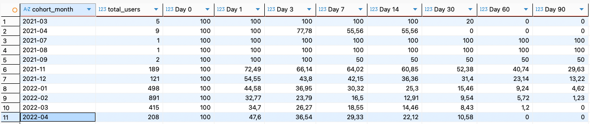
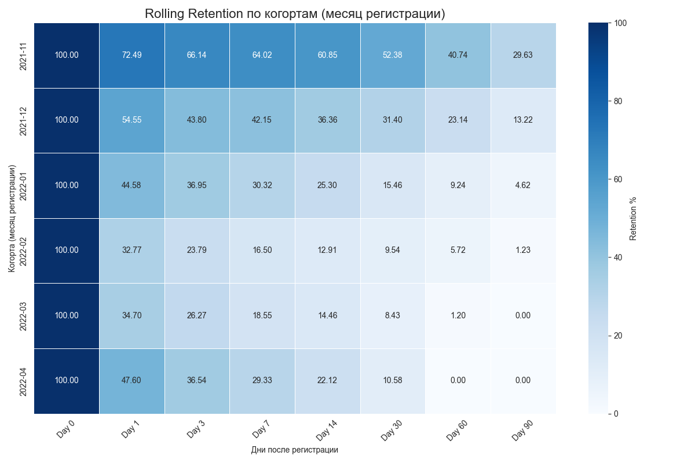
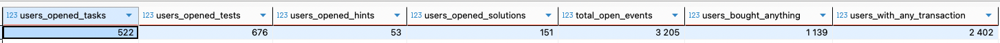

# Задачи IT Resume
## Задание 1: Расчёт rolling retention

**Описание:**  
Rolling retention показывает, какая доля пользователей из когорты (месяц регистрации) вернулась на платформу в день N или позже (0, 1, 3, 7, 14, 30, 60, 90 дней).  

```sql
WITH first_dates AS (
    SELECT
        id,
        date_joined::date AS first_dt
    FROM users
),
last_activity AS (
    SELECT
        f.id,
        f.first_dt,
        MAX(u.entry_at::date) AS last_active_date
    FROM first_dates f
    JOIN userentry u ON f.id = u.user_id
    WHERE u.entry_at::date >= f.first_dt
    GROUP BY f.id, f.first_dt
),
cohorts AS (
    SELECT
        to_char(first_dt, 'YYYY-MM') AS cohort_month,
        COUNT(DISTINCT id) AS total_users,
        COUNT(DISTINCT CASE WHEN last_active_date >= first_dt + INTERVAL '0 days' THEN id END) AS day0,
        COUNT(DISTINCT CASE WHEN last_active_date >= first_dt + INTERVAL '1 day' THEN id END) AS day1,
        COUNT(DISTINCT CASE WHEN last_active_date >= first_dt + INTERVAL '3 days' THEN id END) AS day3,
        COUNT(DISTINCT CASE WHEN last_active_date >= first_dt + INTERVAL '7 days' THEN id END) AS day7,
        COUNT(DISTINCT CASE WHEN last_active_date >= first_dt + INTERVAL '14 days' THEN id END) AS day14,
        COUNT(DISTINCT CASE WHEN last_active_date >= first_dt + INTERVAL '30 days' THEN id END) AS day30,
        COUNT(DISTINCT CASE WHEN last_active_date >= first_dt + INTERVAL '60 days' THEN id END) AS day60,
        COUNT(DISTINCT CASE WHEN last_active_date >= first_dt + INTERVAL '90 days' THEN id END) AS day90
    FROM last_activity
    GROUP BY cohort_month
)
SELECT
    cohort_month,
    total_users,
    ROUND(day0 * 100.0 / total_users, 2) AS "Day 0",
    ROUND(day1 * 100.0 / total_users, 2) AS "Day 1",
    ROUND(day3 * 100.0 / total_users, 2) AS "Day 3",
    ROUND(day7 * 100.0 / total_users, 2) AS "Day 7",
    ROUND(day14 * 100.0 / total_users, 2) AS "Day 14",
    ROUND(day30 * 100.0 / total_users, 2) AS "Day 30",
    ROUND(day60 * 100.0 / total_users, 2) AS "Day 60",
    ROUND(day90 * 100.0 / total_users, 2) AS "Day 90"
FROM cohorts
ORDER BY cohort_month;
```
Результаты 

- В ранних когортах (2021-03, 2021-09) retention аномально высокое (до 100% на D90), но это связано с малым размером когорт, поэтому такие данные нерепрезентативны. Для анализа использовались когорты с достаточным количеством пользователей (с 2021-11).

**Выводы:**
- Rolling retention показывает сильное падение в первые 30 дней: в большинстве когорт после D30 удержание падает ниже 20%, а в когортах 2022 года — часто до 5–10% или ниже.  
- Самое резкое снижение происходит между Day 0 и Day 1 (потеря 50–70% пользователей), а затем падение замедляется.  
- В когортах 2022 года удержание стабильно низкое: на D30 — 8–15%, на D90 — 0–5%. Это говорит о том, что большинство пользователей быстро теряют интерес к платформе.  
- Рекомендации по подпискам:  
  - **Краткосрочная подписка (1 месяц)** — наиболее востребована, так как именно в первые 30 дней происходит основная потеря аудитории.  
## Задание 2: Метрики баланса пользователей

**Описание:**  
Рассчитаны средние значения списаний, начислений, баланса и медианный баланс по всем пользователям с хотя бы одной транзакцией.
```sql
WITH user_metrics AS (
    SELECT 
        t.user_id,
        SUM(t.value) AS balance,
        SUM(CASE WHEN tt.type IN (1, 23, 24, 25, 26, 27, 28, 30) 
                 THEN t.value ELSE 0 END) AS spent,
        SUM(CASE WHEN tt.type NOT IN (1, 23, 24, 25, 26, 27, 28, 30) 
                 THEN t.value ELSE 0 END) AS earned
    FROM transaction t
    JOIN transactiontype tt ON t.type_id = tt.type
    GROUP BY t.user_id
    HAVING COUNT(*) > 0
)
SELECT 
    ROUND(AVG(spent)::numeric, 2) AS "Среднее списание",
    ROUND(AVG(earned)::numeric, 2) AS "Среднее начисление",
    ROUND(AVG(balance)::numeric, 2) AS "Средний баланс",
    ROUND(MODE() WITHIN GROUP (ORDER BY balance), 2) AS "Медианный баланс"
FROM user_metrics;
```
**Выводы:**

- Среднее начисление (306.52) сильно превышает среднее списание (31.29) Это говорит о том, что основная часть коинов приходит от бесплатных действий.  
- Средний баланс — 337.81 коинов, но медианный — всего 53 значит большинство пользователей держат мало коинов, а небольшая группа очень много.  

## Задание 3: расчёт метрик активности пользователей на платформе
-  Сколько в среднем пользователь решает задач: 9,18
```sql
SELECT ROUND(AVG(cnt)::numeric, 2) AS avg_tasks_per_user
FROM (
    SELECT user_id, COUNT(DISTINCT problem_id) AS cnt
    FROM (
        SELECT user_id, problem_id FROM coderun
        UNION
        SELECT user_id, problem_id FROM codesubmit
    ) s
    GROUP BY user_id
) t
```
- Сколько в среднем пользователь проходит тестов: 2,11
```sql
SELECT ROUND(AVG(cnt)::numeric, 2) AS avg_tests_per_user
FROM (
    SELECT user_id, COUNT(*) AS cnt
    FROM teststart
    GROUP BY user_id
) t
```
-  Сколько в среднем пользователь делает попыток для решения 1 задачи: 9,35
```sql
WITH attempts AS (
    SELECT user_id, problem_id FROM coderun
    UNION ALL
    SELECT user_id, problem_id FROM codesubmit
)
SELECT ROUND(AVG(cnt)::numeric, 2) AS avg_attempts_per_task
FROM (
    SELECT user_id, problem_id, COUNT(*) AS cnt
    FROM attempts
    GROUP BY user_id, problem_id
) t
```
- Сколько в среднем пользователь делает попыток для прохождения 1 теста: 1,26

```sql
SELECT ROUND(AVG(cnt)::numeric, 2) AS avg_attempts_per_test
FROM (
    SELECT user_id, test_id, COUNT(*) AS cnt
    FROM teststart
    GROUP BY user_id, test_id
) t
```

- Какая доля от общего числа пользователей решала хотя бы одну задачу или начинала хотя бы один тест: 63,48%
```sql
WITH total AS (
    SELECT COUNT(*) AS total_users
    FROM users
),
active AS (
    SELECT DISTINCT user_id FROM coderun
    UNION
    SELECT DISTINCT user_id FROM codesubmit
    UNION
    SELECT DISTINCT user_id FROM teststart
)
SELECT ROUND(
    (SELECT COUNT(*) FROM active)::numeric
    / (SELECT total_users FROM total) * 100
, 2) AS active_users_share_pct
```
- Покупки материалов за кодкоины

```sql
WITH tx AS (
    SELECT t.user_id, t.type_id
    FROM "transaction" t
),
open_tx AS (
    SELECT *
    FROM tx
    WHERE type_id IN (23, 24, 25, 26, 27)
)
SELECT
    COUNT(DISTINCT CASE WHEN type_id = 23 THEN user_id END) AS users_opened_tasks,
    COUNT(DISTINCT CASE WHEN type_id IN (26, 27) THEN user_id END) AS users_opened_tests,
    COUNT(DISTINCT CASE WHEN type_id = 24 THEN user_id END) AS users_opened_hints,
    COUNT(DISTINCT CASE WHEN type_id = 25 THEN user_id END) AS users_opened_solutions,
    COUNT(*) AS total_open_events,
    COUNT(DISTINCT user_id) AS users_bought_anything,
    (SELECT COUNT(DISTINCT user_id) FROM tx) AS users_with_any_transaction
FROM open_tx
```

**Выводы:**

- В среднем активный пользователь решает 9,18 задач и проходит 2,11 теста — основной сценарий использования платформы связан с задачами
- На 1 задачу приходится 9,35 попыток, а на 1 тест — 1,26, значит задачи чаще требуют многократных итераций и именно вокруг них логично усиливать ценность подписки (например, решения, разборы, и тд).
- Чаще открывают задачи и тесты (522 и 676 пользователей) и существенно реже — подсказки (53) и решения (151), поэтому в подписке наиболее понятной ценностью будут доступ/пакет к задачам и тестам, а подсказки и решения можно использовать как усиливающую фичу 
